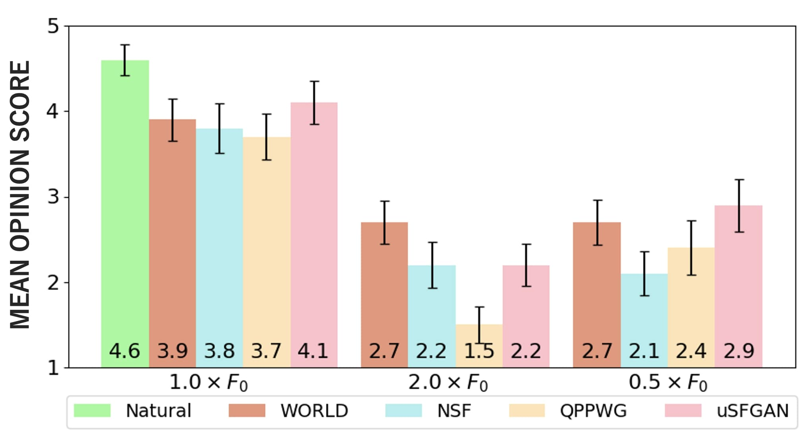

This page is the demo of

1. "Unified Source-Filter GAN: Unified Source-Filter Network Based On Factorization of Quasi-Periodic Parallel WaveGAN" [[paper](https://arxiv.org/abs/2104.04668)] [[code](https://github.com/chomeyama/UnifiedSourceFilterGAN)]

## **Abstract**

 We propose a unified approach to data-driven source-filter modeling using a single neural network for developing a neural vocoder capable of generating high-quality synthetic speech waveforms while retaining flexibility of the source-filter model to control their voice characteristics. Our proposed network called <b>unified source-filter generative adversarial networks (uSFGAN)</b> is developed by factorizing quasi-periodic parallel WaveGAN (QPPWG), one of the neural vocoders based on a single neural network, into a source excitation generation network and a vocal tract resonance filtering network by additionally implementing a regularization loss. Moreover, inspired by neural source filter (NSF), only a sinusoidal waveform is additionally used as the simplest clue to generate a periodic source excitation waveform while minimizing the effect of approximations in the source filter model. The experimental results demonstrate that uSFGAN outperforms conventional neural vocoders, such as QPPWG and NSF in both speech quality and pitch controllability. 

**Corpus and references:**
[CMU-ARCTIC](http://www.festvox.org/cmu_arctic/)
[NSF](https://www.isca-speech.org/archive/SSW_2019/abstracts/SSW10_O_1-1.html)
[NSF_demo](https://nii-yamagishilab.github.io/samples-nsf/nsf-v3.html)
[PWG](https://ieeexplore.ieee.org/abstract/document/9053795)
[PWG_repo](https://github.com/kan-bayashi/ParallelWaveGAN)
[QPNet](https://bigpon.github.io/QuasiPeriodicWaveNet_demo/)
[QPPWG](https://ieeexplore.ieee.org/document/93249760)
[QPPWG_demo](https://bigpon.github.io/QuasiPeriodicParallelWaveGAN_demo/)

## **Architecture of uSFGAN**

 

## **Generator of uSFGAN**

 

## **Non-AR PDCNN ([QPNet](https://bigpon.github.io/QuasiPeriodicWaveNet_demo/), [QPPWG](https://bigpon.github.io/QuasiPeriodicParallelWaveGAN_demo/))**

 

## **Demo Sounds**

- Conditioned on **1**&times;_F_0

| Vocoder                  |                                 Female (clb)                                  |                                  Male (bdl)                                   |
| :----------------------- | :---------------------------------------------------------------------------: | :---------------------------------------------------------------------------: |
| **Natural**              | <audio src="res/audio/natural/clb_arctic_b0475.wav" controls preload></audio> | <audio src="res/audio/natural/bdl_arctic_b0474.wav" controls preload></audio> |
| WORLD \*1     |  <audio src="res/audio/world/clb_arctic_b0475.wav" controls preload></audio>  |  <audio src="res/audio/world/bdl_arctic_b0474.wav" controls preload></audio>  |
| NSF \*2       |   <audio src="res/audio/nsf/clb_arctic_b0475.wav" controls preload></audio>   |   <audio src="res/audio/nsf/bdl_arctic_b0474.wav" controls preload></audio>   |
| QPPWG_20 \*3  |  <audio src="res/audio/qppwg/clb_arctic_b0475.wav" controls preload></audio>  |  <audio src="res/audio/qppwg/bdl_arctic_b0474.wav" controls preload></audio>  |
| uSFGAN_60 \*4 | <audio src="res/audio/usfgan/clb_arctic_b0475.wav" controls preload></audio>  | <audio src="res/audio/usfgan/bdl_arctic_b0474.wav" controls preload></audio>  |

*1. `WORLD: Baseline I` 
*2. `NSF: Neural Source-Filter vocoder of hn-sinc-nsf9` 
*3. `QPPWG_20: QPPWG vocoder with 10 adaptive blocks + 10 fixed blocks` 
*4. `uSFGAN_60: uSFGAN vocoder with source-network of 30 adaptive blocks + filter-network of 30 fixed blocks` 

 

- Conditioned on **0.5**&times;_F_0

| Vocoder   |                                    Female (clb)                                    |                                     Male (bdl)                                     |
| :-------- | :--------------------------------------------------------------------------------: | :--------------------------------------------------------------------------------: |
| WORLD     | <audio src="res/audio/world/clb_arctic_b0475_f0.50.wav" controls preload></audio>  | <audio src="res/audio/world/bdl_arctic_b0474_f0.50.wav" controls preload></audio>  |
| NSF       |  <audio src="res/audio/nsf/clb_arctic_b0475_f0.50.wav" controls preload></audio>   |  <audio src="res/audio/nsf/bdl_arctic_b0474_f0.50.wav" controls preload></audio>   |
| QPPWG_20  | <audio src="res/audio/qppwg/clb_arctic_b0475_f0.50.wav" controls preload></audio>  | <audio src="res/audio/qppwg/bdl_arctic_b0474_f0.50.wav" controls preload></audio>  |
| uSFGAN_60 | <audio src="res/audio/usfgan/clb_arctic_b0475_f0.50.wav" controls preload></audio> | <audio src="res/audio/usfgan/bdl_arctic_b0474_f0.50.wav" controls preload></audio> |

 

- Conditioned on **2.0**&times;_F_0

| Vocoder   |                                    Female (clb)                                    |                                     Male (bdl)                                     |
| :-------- | :--------------------------------------------------------------------------------: | :--------------------------------------------------------------------------------: |
| WORLD     | <audio src="res/audio/world/clb_arctic_b0475_f2.00.wav" controls preload></audio>  | <audio src="res/audio/world/bdl_arctic_b0474_f2.00.wav" controls preload></audio>  |
| NSF       |  <audio src="res/audio/nsf/clb_arctic_b0475_f2.00.wav" controls preload></audio>   |  <audio src="res/audio/nsf/bdl_arctic_b0474_f2.00.wav" controls preload></audio>   |
| QPPWG_20  | <audio src="res/audio/qppwg/clb_arctic_b0475_f2.00.wav" controls preload></audio>  | <audio src="res/audio/qppwg/bdl_arctic_b0474_f2.00.wav" controls preload></audio>  |
| uSFGAN_60 | <audio src="res/audio/usfgan/clb_arctic_b0475_f2.00.wav" controls preload></audio> | <audio src="res/audio/usfgan/bdl_arctic_b0474_f2.00.wav" controls preload></audio> |

 

## **Ablation Study**

- Comparison of waveforms and spectrograms of output source signals with (left) and without (right) the spectral envelope regularization loss

 

- Comparison of sound of the output source signals with and without regularization loss

| Condition                                       |                                          Female (clb)                                          |                                           Male (bdl)                                           |
| :---------------------------------------------- | :--------------------------------------------------------------------------------------------: | :--------------------------------------------------------------------------------------------: |
| **1.0**&times;_F_0 w/ Lr  |        <audio src="res/audio/usfgan/clb_arctic_b0475_src.wav" controls preload></audio>        |        <audio src="res/audio/usfgan/bdl_arctic_b0474_src.wav" controls preload></audio>        |
| **0.5**&times;_F_0 w/ Lr  |     <audio src="res/audio/usfgan/clb_arctic_b0475_f0.50_src.wav" controls preload></audio>     |     <audio src="res/audio/usfgan/bdl_arctic_b0474_f0.50_src.wav" controls preload></audio>     |
| **2.0**&times;_F_0 w/ Lr  |     <audio src="res/audio/usfgan/clb_arctic_b0475_f2.00_src.wav" controls preload></audio>     |     <audio src="res/audio/usfgan/bdl_arctic_b0474_f2.00_src.wav" controls preload></audio>     |
| **1.0**&times;_F_0 w/o Lr |    <audio src="res/audio/usfgan_no_loss/clb_arctic_b0475_src.wav" controls preload></audio>    |    <audio src="res/audio/usfgan_no_loss/bdl_arctic_b0474_src.wav" controls preload></audio>    |
| **0.5**&times;_F_0 w/o Lr | <audio src="res/audio/usfgan_no_loss/clb_arctic_b0475_f0.50_src.wav" controls preload></audio> | <audio src="res/audio/usfgan_no_loss/bdl_arctic_b0474_f0.50_src.wav" controls preload></audio> |
| **2.0**&times;_F_0 w/o Lr | <audio src="res/audio/usfgan_no_loss/clb_arctic_b0475_f2.00_src.wav" controls preload></audio> | <audio src="res/audio/usfgan_no_loss/bdl_arctic_b0474_f2.00_src.wav" controls preload></audio> |

 

## **Subjective Results**

- MOS results of speech quality

 

- XAB results of pitch accuracy

 
 

[Home](https://github.com/chomeyama/)

 
 
