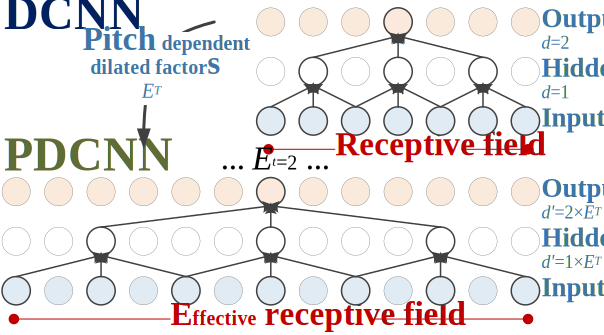

This page is the demo of 
1. "Unified Source-Filter GAN: Unified Source-Filter Network Based On Factorization of Quasi-Periodic Parallel WaveGAN"  [[code](https://github.com/chomeyama/UnifiedSourceFilterGAN)]

## **Abstract**  

 We propose a unified approach to data-driven source-filter modeling using a single neural network for developing a neural vocoder capable of generating high-quality synthetic speech waveforms while retaining flexibility of the source-filter model to control their voice characteristics. Our proposed network called <b>unified source-filter generative adversarial networks (uSFGAN)</b> is developed by factorizing quasi-periodic parallel WaveGAN (QPPWG), one of the neural vocoders based on a single neural network, into a source excitation generation network and a vocal tract resonance filtering network by additionally implementing a regularization loss. Moreover, inspired by neural source filter (NSF), only a sinusoidal waveform is additionally used as the simplest clue to generate a periodic source excitation waveform while minimizing the effect of approximations in the source filter model. The experimental results demonstrate that uSFGAN outperforms conventional neural vocoders, such as QPPWG and NSF in both speech quality and pitch controllability. 

**Corpus and references:**  
[CMU-ARCTIC](http://www.festvox.org/cmu_arctic/)  
[VCC2018](http://www.vc-challenge.org/)  
[NSF](https://www.isca-speech.org/archive/SSW_2019/abstracts/SSW10_O_1-1.html)
[NSF_demo](https://nii-yamagishilab.github.io/samples-nsf/nsf-v3.html)
[PWG](https://ieeexplore.ieee.org/abstract/document/9053795)  
[PWG_repo](https://github.com/kan-bayashi/ParallelWaveGAN)  
[QPNet](https://bigpon.github.io/QuasiPeriodicWaveNet_demo/)      
[QPPWG](https://ieeexplore.ieee.org/document/93249760)  
[QPPWG_demo](https://bigpon.github.io/QuasiPeriodicParallelWaveGAN_demo/)  

## **Architecture of uSFGAN**

  

## **Generator of uSFGAN**

  
    
## **Non-AR PDCNN ([QPNet](https://bigpon.github.io/QuasiPeriodicWaveNet_demo/), [QPPWG_demo](https://bigpon.github.io/QuasiPeriodicParallelWaveGAN_demo/))**  

  
  
## **Demo Sounds**
- Conditioned on **1**&times;*F*0

| Vocoder                | Female (SF3)                                                                   | Male (SM3)                                                                     |
|:-----------------------|:------------------------------------------------------------------------------:|:------------------------------------------------------------------------------:|
| **Natural**            | <audio src="res/audio/SF3/Natural/30013.wav" controls preload></audio>         | <audio src="res/audio/SM3/Natural/30017.wav" controls preload></audio>         |
| WORLD *1    | <audio src="res/audio/SF3/1_0_F0/WORLD/30013.wav" controls preload></audio>    | <audio src="res/audio/SM3/1_0_F0/WORLD/30017.wav" controls preload></audio>    |
| QPNet *2    | <audio src="res/audio/SF3/1_0_F0/QPNet/30013.wav" controls preload></audio>    | <audio src="res/audio/SM3/1_0_F0/QPNet/30017.wav" controls preload></audio>    |
| PWG_30 *3   | <audio src="res/audio/SF3/1_0_F0/PWG_30/30013.wav" controls preload></audio>   | <audio src="res/audio/SM3/1_0_F0/PWG_30/30017.wav" controls preload></audio>   |
| PWG_20 *4   | <audio src="res/audio/SF3/1_0_F0/PWG_20/30013.wav" controls preload></audio>   | <audio src="res/audio/SM3/1_0_F0/PWG_20/30017.wav" controls preload></audio>   |
| QPPWG_20 *5 | <audio src="res/audio/SF3/1_0_F0/QPPWG_20/30013.wav" controls preload></audio> | <audio src="res/audio/SM3/1_0_F0/QPPWG_20/30017.wav" controls preload></audio> |
| PWG_16 *6   | <audio src="res/audio/SF3/1_0_F0/PWG_16/30013.wav" controls preload></audio>   | <audio src="res/audio/SM3/1_0_F0/PWG_16/30017.wav" controls preload></audio>   |
| QPPWG_16 *7 | <audio src="res/audio/SF3/1_0_F0/QPPWG_16/30013.wav" controls preload></audio> | <audio src="res/audio/SM3/1_0_F0/QPPWG_16/30017.wav" controls preload></audio> |

*1. `WORLD: Baseline I`   
*2. `NSF: Neural Source-Filter vocoder of hn-sinc-nsf9`   
*3. `QPPWG_20: QPPWG vocoder with 10 adaptive blocks + 10 fixed blocks`   
*4. `uSFGAN_60: uSFGAN vocoder with source-network of 30 adaptive blocks + filter-network of 30 fixed blocks`   

   
- Conditioned on **&frac12;**&times;*F*0

| Vocoder  | Female (SF3)                                                                   | Male (SM3)                                                                     |
|:---------|:------------------------------------------------------------------------------:|:------------------------------------------------------------------------------:|
| WORLD    | <audio src="res/audio/SF3/0_5_F0/WORLD/30013.wav" controls preload></audio>    | <audio src="res/audio/SM3/0_5_F0/WORLD/30017.wav" controls preload></audio>    |
| QPNet    | <audio src="res/audio/SF3/0_5_F0/QPNet/30013.wav" controls preload></audio>    | <audio src="res/audio/SM3/0_5_F0/QPNet/30017.wav" controls preload></audio>    |
| PWG_30   | <audio src="res/audio/SF3/0_5_F0/PWG_30/30013.wav" controls preload></audio>   | <audio src="res/audio/SM3/0_5_F0/PWG_30/30017.wav" controls preload></audio>   |
| PWG_20   | <audio src="res/audio/SF3/0_5_F0/PWG_20/30013.wav" controls preload></audio>   | <audio src="res/audio/SM3/0_5_F0/PWG_20/30017.wav" controls preload></audio>   |
| QPPWG_20 | <audio src="res/audio/SF3/0_5_F0/QPPWG_20/30013.wav" controls preload></audio> | <audio src="res/audio/SM3/0_5_F0/QPPWG_20/30017.wav" controls preload></audio> |
| PWG_16   | <audio src="res/audio/SF3/0_5_F0/PWG_16/30013.wav" controls preload></audio>   | <audio src="res/audio/SM3/0_5_F0/PWG_16/30017.wav" controls preload></audio>   |
| QPPWG_16 | <audio src="res/audio/SF3/0_5_F0/QPPWG_16/30013.wav" controls preload></audio> | <audio src="res/audio/SM3/0_5_F0/QPPWG_16/30017.wav" controls preload></audio> |
  
   
- Conditioned on **2**&times;*F*0

| Vocoder  | Female (SF3)                                                                   | Male (SM3)                                                                     |
|:---------|:------------------------------------------------------------------------------:|:------------------------------------------------------------------------------:|
| WORLD    | <audio src="res/audio/SF3/2_0_F0/WORLD/30013.wav" controls preload></audio>    | <audio src="res/audio/SM3/2_0_F0/WORLD/30017.wav" controls preload></audio>    |
| QPNet    | <audio src="res/audio/SF3/2_0_F0/QPNet/30013.wav" controls preload></audio>    | <audio src="res/audio/SM3/2_0_F0/QPNet/30017.wav" controls preload></audio>    |
| PWG_30   | <audio src="res/audio/SF3/2_0_F0/PWG_30/30013.wav" controls preload></audio>   | <audio src="res/audio/SM3/2_0_F0/PWG_30/30017.wav" controls preload></audio>   |
| PWG_20   | <audio src="res/audio/SF3/2_0_F0/PWG_20/30013.wav" controls preload></audio>   | <audio src="res/audio/SM3/2_0_F0/PWG_20/30017.wav" controls preload></audio>   |
| QPPWG_20 | <audio src="res/audio/SF3/2_0_F0/QPPWG_20/30013.wav" controls preload></audio> | <audio src="res/audio/SM3/2_0_F0/QPPWG_20/30017.wav" controls preload></audio> |
| PWG_16   | <audio src="res/audio/SF3/2_0_F0/PWG_16/30013.wav" controls preload></audio>   | <audio src="res/audio/SM3/2_0_F0/PWG_16/30017.wav" controls preload></audio>   |
| QPPWG_16 | <audio src="res/audio/SF3/2_0_F0/QPPWG_16/30013.wav" controls preload></audio> | <audio src="res/audio/SM3/2_0_F0/QPPWG_16/30017.wav" controls preload></audio> |
  
  

## **Subjective Results** 
- MOS results of speech quality  

  
- XAB results of pitch accuracy  

  
  

## **Visualized Intermediate Outputs** 

 Because the waveform outputs of the PWG/QPPWG models are the cumulative results of the skip connections from the residual blocks, the speech modeling behavior of the residual blocks can be explored via the visualized intermediate outputs of partial residual blocks. The following table shows the spectrograms of the intermediate outputs of the cumulative residual blocks. 
 

<table border="0">
  <tr>
  <td align="center"> <b>PWG (PWG_20) </b> </td>
  <td align="center"> <b>QPPWG (adaptive->fixed)</b> </td>
  <td align="center"> <b>QPPWG (fixed->adaptive)</b> </td>
  </tr>
  <tr>
  <td align="center"> 1-20: fixed blocks </td>
  <td align="center"> 1-10: adaptive blocks   11-20: fixed blocks </td>
  <td align="center"> 1-10: fixed blocks   11-20: adaptive blocks </td>
  </tr>
  <tr> <td colspan="3" align="center"> Conditioned on <b>1</b>&times;<i>F</i>0 </td> </tr>
  <tr>
  <td>  </td>
  <td>  </td>
  <td>  </td>
  </tr>
  <tr> <td colspan="3" align="center"> Conditioned on <b>&frac12;</b>&times;<i>F</i>0 </td> </tr>
  <tr>
  <td>  </td>
  <td>  </td>
  <td>  </td>
  </tr>
  <tr> <td colspan="3" align="center"> Conditioned on <b>2</b>&times;<i>F</i>0 </td> </tr>
  <tr>
  <td>  </td>
  <td>  </td>
  <td>  </td>
  </tr>
</table>

According to the results, we can find that
- **PWG (PWG_20)**: spectrograms contain more harmonic and non-harmonic details as the number of the cumulative residual blocks increases. 
- **QPPWG (adaptive->fixed)**: the first ten adaptive blocks focus on modeling the harmonic components. 
- **QPPWG (fixed->adaptive)**: the first ten fixed blocks focus on modeling the the non-harmonic components.  

Furthermore, the audio files of the QPPWG intermediate outputs are also provided.

<table border="0">
  <tr>
  <td align="center"> <b>  </b> </td>
  <td align="center"> <b>QPPWG (adaptive->fixed)</b> </td>
  <td align="center"> <b>QPPWG (fixed->adaptive)</b> </td>
  </tr>
  <tr>
  <td align="center"> 1-10 blocks </td>
  <td align="center"> adaptive blocks </td>
  <td align="center"> fixed blocks </td>
  </tr>
  <tr> <td colspan="3" align="center"> Conditioned on <b>1</b>&times;<i>F</i>0 </td> </tr>
  <tr>
  <td align="center"> outputs of   1-10 blocks </td>
  <td align="center">  
  <audio src="res/audio/mid/QPPWGaf/1_0_F0/SF3_30029_o9.wav" controls preload></audio> </td>
  <td align="center">  
  <audio src="res/audio/mid/QPPWGfa/1_0_F0/SF3_30029_o9.wav" controls preload></audio> </td>
  </tr>
  <tr>
  <td align="center"> Final outputs </td>
  <td> <audio src="res/audio/mid/QPPWGaf/1_0_F0/SF3_30029_o19.wav" controls preload></audio> </td>
  <td> <audio src="res/audio/mid/QPPWGfa/1_0_F0/SF3_30029_o19.wav" controls preload></audio> </td>
  </tr>
  <tr> <td colspan="3" align="center"> Conditioned on <b>&frac12;</b>&times;<i>F</i>0 </td> </tr>
  <tr>
  <td align="center"> outputs of   1-10 blocks </td>
  <td align="center">  
  <audio src="res/audio/mid/QPPWGaf/0_5_F0/SF3_30029_o9.wav" controls preload></audio> </td>
  <td align="center">  
  <audio src="res/audio/mid/QPPWGfa/0_5_F0/SF3_30029_o9.wav" controls preload></audio> </td>
  </tr>
  <tr>
  <td align="center"> Final outputs </td>
  <td> <audio src="res/audio/mid/QPPWGaf/0_5_F0/SF3_30029_o19.wav" controls preload></audio> </td>
  <td> <audio src="res/audio/mid/QPPWGfa/0_5_F0/SF3_30029_o19.wav" controls preload></audio> </td>
  </tr>
  <tr> <td colspan="3" align="center"> Conditioned on <b>2</b>&times;<i>F</i>0 </td> </tr>
  <tr>
  <td align="center"> outputs of   1-10 blocks </td>
  <td align="center">  
  <audio src="res/audio/mid/QPPWGaf/2_0_F0/SF3_30029_o9.wav" controls preload></audio> </td>
  <td align="center">  
  <audio src="res/audio/mid/QPPWGfa/2_0_F0/SF3_30029_o9.wav" controls preload></audio> </td>
  </tr>
  <tr>
  <td align="center"> Final outputs </td>
  <td> <audio src="res/audio/mid/QPPWGaf/2_0_F0/SF3_30029_o19.wav" controls preload></audio> </td>
  <td> <audio src="res/audio/mid/QPPWGfa/2_0_F0/SF3_30029_o19.wav" controls preload></audio> </td>
  </tr>
</table>

 The cumulative outputs of the adaptive blocks are excitation-signal-like and highly pitch-dependent while that of the fixed blocks are spectral-related and less pitch-dependent. The results confirm our assumption that that the adaptive blocks with the PDCNNs primarily model the pitch-related speech components with the long-term correlations while the fixed blocks with the DCNNs mainly focus on the spectral-related speech components with the short-term correlations. 

  
[Home](https://github.com/chomeyama/)

   
   